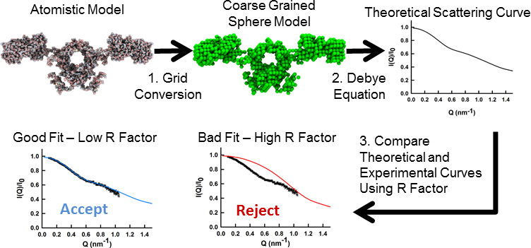
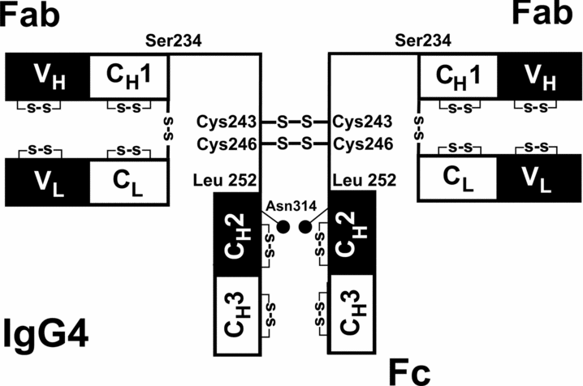

---
author:
- name: David W. Wright
  orcid: 0000-0002-5124-8044
  affiliation: Structural Immunology Group, University College London, London
bibliography: references.bib
---

#Tutorial - Using Modern SCT for Constrained Modelling

In this tutorial we will use examples based on the recent paper by Rayner _et al._ [-@Rayner29052014] to illustrate how to run the SCT constrained modelling workflow. 
We start with six models of the IgG4 molecule and compare these to scattering curves obtained from both neutron and x-ray scattering experiments.

The SCT process involves the creation of coarse grained sphere models from atomic protein structures. 
These are in turn used to calculate theoretical scattering curves for comparison with experimental SAS data which allows us to identify models which represent the average solution structure of the protein of interest.

If you have not already done so [install SCT]().

The files needed for this tutorial can be found in the _modern-tutorial_ folder or extracted from [sct-tutorial.tgz]().

For the rest of this tutorial we will assume that you have changed into the directory containing the tutorial files.

## Initial Structures

The IgG4 molecule is typical of antibody structures, consisting of four chains with a particular geometry with two regions (the Fc and Fab) connected by long linker regions (illustrated in the picture below, adapted from [@YukiAbe11252010]).
The two larger chains are called the heavy chains and constitute the Fab domain, the linkers and part of each Fab domain. 
The light chains are confined to the Fab region.

The first thing to do is to inspect the six structures in the _pdbs_ directory. 
Use either your favourite molecular viewer (such as [pymol](http://www.pymol.org/) or [VMD](http://www.ks.uiuc.edu/Research/vmd/). 
You will see that three of the structures have widely separated FAB regions and in the other three both FAB sections are close together.

These are all homology models, generated using the [SWISS-MODEL](http://swissmodel.expasy.org/) software [@Biasini29042014], based on crystal structures of IgG1 (taken from PDBs: [1BBJ](http://www.rcsb.org/pdb/explore.do?structureId=1bbj) & [1HZH](http://www.rcsb.org/pdb/explore.do?structureId=1hzh).

## Identify an Extended Structure

In order to correctly parametrize the creation of sphere models we require a model of the protein in which there is as little atomic overlap as possible. In this case this is likely to be an extended conformation.

As you have seen _model1.pdb_ is an extended model of IgG4. 
We will use this to help choose our sphere modelling parameters.

## Scattering Data

Scattering data files are in the format of 1st column, Q, 2nd column, I(Q), and, in most cases, a 3rd column which is the error in I(Q).

At some instruments, for example BM29, the data is automatically monitored for radiation damage and the frames summed accordingly.
If the data was generated from an instrument without this software, single timeframes must be compared to the overall merged file and checked for deviations at low Q. 
Radiation damage will present itself as an upturn at the low Q portion of the curve. Only scattering curves free from radiation damage should be analysed.

Viewing the entire scattering curve can be achieved by viewing the ‘wide-angle’ plot, to view the whole scattering curve and looking at its overall shape. This is given by plotting Q vs Ln(I(Q)).
From this, you can identify anomalous scattering at low Q (possibly from the beam stop, aggregation or radiation damage) and also the maximum useable range of the data (cut off before the data becomes too noisy).

## Identify Suitable Ranges for Guinier Fits

The scattering curve can be analysed by Guinier analysis to give Rg (radius of gyration) and RXS (cross-sectional radius).
Immunoglobulins have two distinct Rxs ranges (termed Rxs1 and Rxs2), with Rxs1 thought to correspond to the overall cross-section of the molecule, and RXS-2 to the cross-section of the individual Fc and Fab domains.

Rg can be determined by the Guinier approximation. 
To do this, the scattering curve is visualised by plotting Q^2 vs Ln(I(Q)) to show the beginning portion of the scattering curve as linear. Fitting to this region will give Rg. Selection of the portion of the scattering curve to fit to is determined by choosing two Q values. 
In an ideal case, the first Q value (Qmin) would be the first scattering point at low Q (i.e. as close to zero as the instrument measures). The Qmax value is determined by Q\*Rg range. For globular proteins this is limited at around Q\*Rg of 1.5.

This is repeated for Rxs1 and Rxs2 by visual inspection of the curves. To visualise the linear portions, the scattering curve is viewed as Q^2 vs ln(I(Q)\*Q)

## Parameter File

In the new version of SCT the parameters used to create sphere models and to analyse the experimental and theoretical scattering curve are combine in a single input file. 
The file is in the [YAML](http://www.yaml.org/) format which is nicely human readable and uses indentation to express data structure hierarchy. 
Note that all distance measures must be entered in Å.

The initial version of this file for use in this tutorial is in _params.yml_. At the beginning of this tutorial the values are set to defaults which are plausible but unlikely to be valid for any specific target system. We will edit various sections of this file as we proceed.

A full description of all possible sections that can be included in this file can be found [here]().

The range of values used in the calculation of the Rg and Rxs1 are given by the 'fitmin' and 'fitmax' values in the 'rg' and 'rxs1' sections of the parameter file. The ranges used (0.015 to 0.028 Å for Rg and 0.031 to 0.051 Å for Rxs1) were taken directly from the study by Rayner _et al._ [-@Rayner29052014].

## Optimize the Parameters Used in Sphere Modelling

An important consideration in the constrained modelling process is how to create coarse grained models which represent the input atomic models.
The procedure used in SCT is to construct a grid around the protein and to place spheres in the sphere model only for grid boxes containing more than a threshold number of atoms. 
An illustration of this process in two dimensions is shown in the figure below. 
This coarse graining will obviously lose some detail but we wish to retain as much information about the shape of the protein as possible and to replicate accurately the proteins volume. Usually the threshold (which we term the cut-off here) is set to 4 atoms and the resolution of the grid is varied to reproduce the correct volume.

In SCT the target volume is calculated from the protein sequence [@Perkins1986].
If the atomistic model being used contains the full sequence then this is the only input required for this stage of the modelling.
If however, like in this instance, the model has missing residues then a second file specifying the sequence should be provided. 
This file can either be a YAML file containing key/value pairs of the residue names (three letter codes) and frequencies or a [FASTA](http://en.wikipedia.org/wiki/FASTA_format) format file of the sequence. 
In either instance all chains in the model must be explicitly included in the sequence input file.

Here we use the FASTA file _migg4.fas_. 
Open this file in a text editor to see both the format at the repetition necessary to provide the information needed for all 4 chains.

To run the optimization code enter the following command:

~~~~~~
optimize_model_params.py -p params.yml -i pdbs/model1.pdb -s migg4.fas -f fas
~~~~~~

Here the command line flag _-p_ indicates the path to the parameter file to be read, _-i_ the path to the input PDB model, _-s_ the path to the sequence file and _-f_ the format of the sequence files ('fas' = FASTA, 'yml' = YAML). 
Only two values are used from the _params.yml_, they are the 'cutoff' specified under the 'sphere' section and 'positions' under the 'hydrate' section. 
The 'cutoff' value determines the minimum number of atoms within a grid box at which a sphere is created in the coarse gained model. 
The value, 4, used in _params.yml_ has been found to work well for a range of proteins. 
The 'positions' value should always be 27.

The running of _optimize_model_params.py_ will create a file called _optimized_params.txt_. 
Open this file in a text editor, we will now extract the parameter values we need to create consistent sphere models of the unhydrated and hydrated models.

## Parameters for Unhydrated Models

The important parameter for the unhydrated (dry) models is the size of the grid boxes used to create the sphere models. 
The size of the grid box determines the radius of the spheres in the model. 
The optimized radius is given in the _optimized_params.txt_ file after the text 'Sphere model box side'.

The size of the box is optimized to recreate the correct protein volume. 
To check that the procedure has worked compare the values given for 'Target dry volume' which was calculated from the protein sequences and 'Model dry volume' which is computed directly from the sphere model.

Open the file _params.yml_ and edit the 'boxside' value in the 'sphere' section to agree with the 'Sphere model box side' entry in the _optimized_params.txt_ file (this should be 5.3968).

## Parameters for Hydrated Models

The hydration routine initially adds an excess of spheres to the unhydrated sphere model which are then filtered out using a second cutoff. 
This is the 'cutoff' listed in the 'hydrate' section of the parameter file.

The optimization routine for the hydration cutoff is experimental and whilst a recommended value ('Suggested hydration cutoff') is available in _optimized_params.txt_ in most cases you will need to manually compare the 'Target hydrated volume' value to the 'Hydrated volume' for each cutoff to determine the optimal value. 
Once you have selected this enter as the 'cutoff' listed in the 'hydrate' section of the _params.yml_ (the best value should be 9).

## Create a Sphere Model

Now that we have updated the parameter file to create optimal models for our system we should create a sphere model and see how well it reproduces the original atomic model.

Run the following command:

~~~~~~
pdb2sphere.py -p params.yml -i pdbs/model1.pdb -m project -o model1.sph
~~~~~~

The _-p_ and _-i_ flags have the same meaning as for the optimize_model_params.py command. 
The _-m_ flag decides on the type of output (here a sphere model is output to file and summary information to stdout, i.e. the command line) and _-o_ specifies the output file path.

The resultant file _model1.sph_ contains three columns; x, y, z and radius. 
This file cannot be opened by conventional structure viewing programs. 
In order to view the structure we will convert it into PDB format using:

~~~~~~
sphere2pdb.py -i model1.sph -o model1_sphere.pdb
~~~~~~

Here _-i_ is the input sphere file and _-o_ the output PDB file.

You can now load the original atomic model (_pdbs/model1.pdb_) and the sphere model (_model1_sphere.pdb_) into a viewer to compare them. In both pymol and VMD it is possible to view the sphere model as spheres with the radius used in the modelling process (boxside / 2).

## Hydrate the Sphere Model

In order to create a hydrated model of the IgG4 we run the command:

~~~~~~
hydrate_spheres.py -p params.yml -i model1.sph -o model1_hyd.sph
~~~~~~

This again results in a three column file which cannot be easily viewed as a structure. 
It is left as an exercise for the user to convert the hydrated sphere model into a PDB for viewing.

## Calculate Theoretical Scattering Curve

Now we will create a theoretical scattering curve from the hydrated sphere model. 
The command to do this is:

~~~~~~
calculate_curve.py -p params.yml -i model1_hyd.sph -f sph -x -o hyd_curve.scx
~~~~~~

The _-i_ flag here can accept either a sphere file or a PDB, it is assumed to be a PDB unless you set _-f_ to 'sph' to indicate it is a sphere file. The _-x_ flag indicates that we want to output a curve for comparison with x-ray data and no smearing should be applied. Otherwise a smearing correction would be applied to the curve using the values specified in the _params.yml_ file as 'smear' in the 'curve' section in that file is set to 'True'. The resultant curve is saved in the file specified by _-o_.

The output file is a simple two column file. 
The two columns being the magnitude of the scattering vector (Q) and the intensity (I).

The parameters used to control the creation of the curve in the _params.yml_ file are all in the 'curve' subsection:

|   Key                       |   Description                                                     |
|-----------------------------|:------------------------------------------------------------------|
| qmax                        | Maximum Q value for which to compute an intensity value           |
| npoints                     | Number of Q values to compute the intensity value at              |
| radbins                     | Number of bins used in the Debye equation histogram (In all likelihood you will never need to alter this) |
| smear                       | Should Neutron curves be smeared - True or False                  |
| wavelength                  | Neutron smearing parameter - the wavelength of the incident beam  |
| spread                      | Neutron smearing parameter - spread of the incident beam          |
| divergence                  | Neutron smearing parameter - divergence of the incident beam      |

## Compare Theoretical and Experimental Curves

In order to compare the calculated curve with experimental results we use a measure known as the [R factor](http://en.wikipedia.org/wiki/R-factor_%28crystallography%29) by analogy with crystallography.
The R factor is a percentage with a value of less than 5 % representing a good match between the two curves.

~~~~~~~
calculate_rfactor.py -p params.yml -c hyd_curve.scx -e expt/x_1.dat -o rfac_model1.dat
~~~~~~~

The _-c_ flag specifies the input calculated (theoretical) curve, _-e_ the experimental curve and _-o_ the output file. 
The output file contains four columns; the experimental data file, the theoretical curve file, then the scaling factor used to match the curves and the R factor. 
The scaling factor provided is the value needed to multiply the theoretical curve intensity to match its experimental counterpart.

In the _params.yml_ file the range over which the comparison takes place is defined by the 'qmin' and 'qmax' values in the 'rfac' section.

The R factor here is > 35 % indicating a very poor fit between out theoretical model and the experimental result. 
You should now plot the experimental and theoretical curves to see just how bad the fit is. Remember to use the scaling factor to multiply the intensity.

An example command to do this in [gnuplot](http://www.gnuplot.info/) would be:

~~~~~~~
plot 'expt/x_1.dat' u 1:2, 'hyd_curve.scx' u 1:(0.0215 * $2)
~~~~~~~

In this example 0.0215 is the scaling factor.

## Run SCT Workflow

In real constrained modelling applications you would want to run the steps above (from sphere model creation to curve comparison) many thousands of times and perhaps to compare the results to several curves. This can easily be achieved using the SCT workflow tool.

In this tutorial we will run the work flow on a limit selection of 6 models and three experimental curves (two x-ray and one neutron) but this will illustrate how to do larger data sets. The basic command you need to run is:

~~~~~~~
sct_pdb_analysis.py -p params.yml -i pdbs/ -o igg4 -x expt/x_1.dat expt/x_2.dat -n expt/n.dat -t igg4
~~~~~~~

In this case _-i_ is the path to the directory containing the PDBs we wish to analyse, _-o_ is the path to a directory in which all of the output will be stored, _-x_ is a list of all of the experimental x-ray curves to be compared against and _-n_ a list of all of the neutron curves to be used in comparisons. 
The _-t_ flag provides the title prefix for the output summary files.

Running this command will create the following hierarchy of files and folders:

igg4/neutron/models/*.pdb

| Files                       | Description  |
|-----------------------------|--------------|
| igg4/igg4_expt.sum          | Summary of the Rg and Rxs1 values for all experimental curves |
| igg4/igg4.sum               | Summary data for all of the models compared to all of the experimental curves |
| igg4/xray/curves/\*.scx     | Model x-ray scattering curves  |
| igg4/xray/models/\*.pdb     | Unhydrated sphere model PDBs  |
| igg4/neutron/curves/\*.scn  | Model x-ray scattering curves  |
| igg4/neutron/models/\*.pdb  | Hydrated sphere model PDBs  |

The * is replaced by the name of the original PDB files for the model and curve files.

The summary files are output as tab separated columns. The easiest way to see the table correctly is to open it in Microsoft Excel or LibreOffice Calc. 
When you look at the output data you will see that three of the models have low R factors in comparison to all of the curves, indicating a good fit, and three have high ones, indicating a poor fit. 
You can now look at the two sets of models to see how they differ from one another.

You can also compare the scattering curves (again remembering to account for the scaling factor). 
An example command for looking at one good and one bad fit against the experimental neutron curve using gnuplot is:

~~~~~~
plot './expt/n.dat' u 1:2, './igg4/neutron/curves/model1.scn' u 1:(0.1855*$2), './igg4/neutron/curves/model6.scn' u 1:(0.1334*$2)
~~~~~~

*Notes:*

You need not provide curves for both x-ray and neutron experiments. 
A single curve of either flavour is enough.

If your input curves do not have Q in units of Å^-1 but nm^-1 then you can use the flags _-xu_ and _-nu_ to set the units for the x-ray and neutron input respectively (specify 'nm' to have the units converted from nm to Å). 
All curves from the same type of source are assumed to use the same units.

### References

